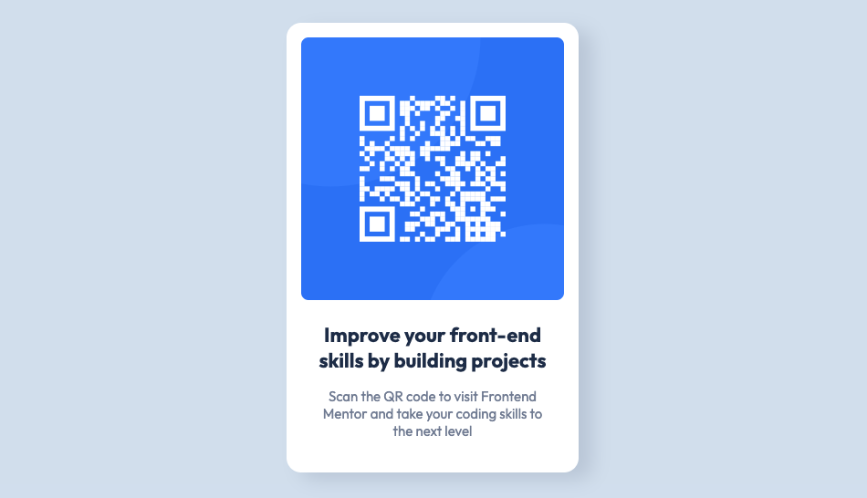

# Frontend Mentor - QR code component solution

This is a solution to the [QR code component challenge on Frontend Mentor](https://www.frontendmentor.io/challenges/qr-code-component-iux_sIO_H). Frontend Mentor challenges help you improve your coding skills by building realistic projects. 

## Table of contents

- [Overview](#overview)
  - [Screenshot](#screenshot)
  - [Links](#links)
- [My process](#my-process)
  - [Built with](#built-with)
  - [What I learned](#what-i-learned)
- [Author](#author)

**Note: Delete this note and update the table of contents based on what sections you keep.**

## Overview

### Screenshot



This wasn't a difficult project to code. I set the container to 320px wide and added figure and section containers. The image went inside the figure and the text goes into the section. Apply padding, colors, rounded corners, text styling and a box-shadow on the main container.

This layout is narrow enough that it doesn't require a mobile view.

### Links

- Solution URL: [Add solution URL here](https://your-solution-url.com)
- Live Site URL: [Add live site URL here](https://your-live-site-url.com)

## My process

### Built with

- Semantic HTML5 markup
- CSS custom properties
- CSS Grid

### What I learned

The box-shadow is difficult to code just by looking at the preview. If I had the Figma or Sketch files, the parameters could be extracted, but I think my solution is good enough.

To see how you can add code snippets, see below:

```css
.container {
  width: 320px;
  background-color: hsl(0, 0%, 100%);
  padding: 1rem;
  border-radius: 1rem;
  box-shadow: 15px 8px 20px hsla(220, 15%, 55%, 25%);
}
```

## Author

- Website - [Add your name here](https://www.your-site.com)
- Frontend Mentor - [@yourusername](https://www.frontendmentor.io/profile/yourusername)

**Note: Delete this note and add/remove/edit lines above based on what links you'd like to share.**

